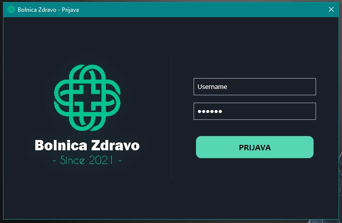
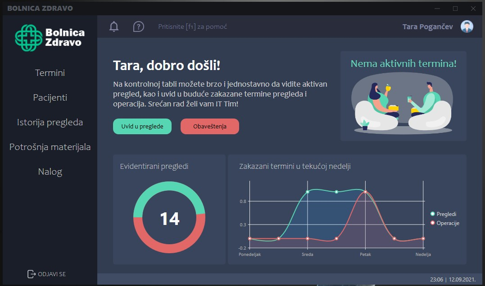
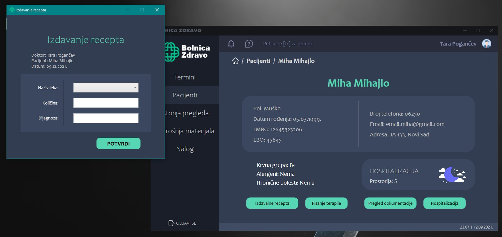
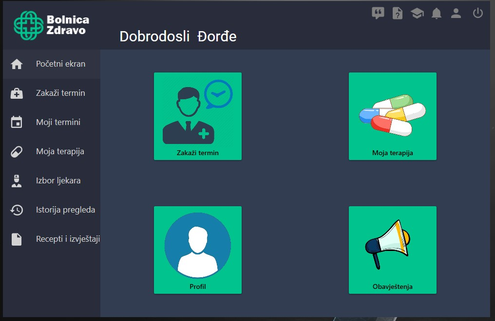
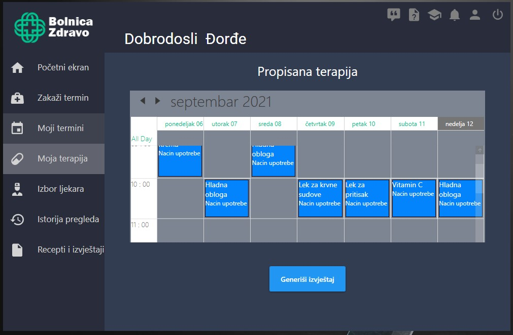
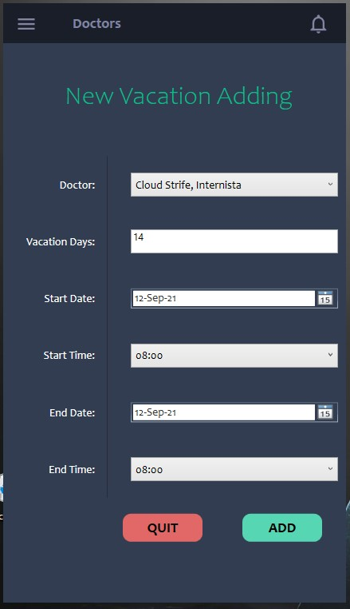
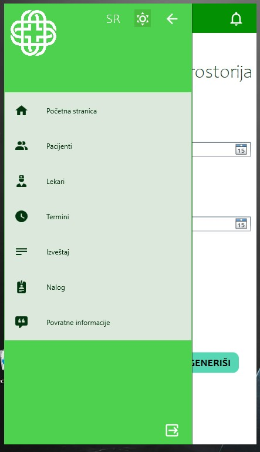
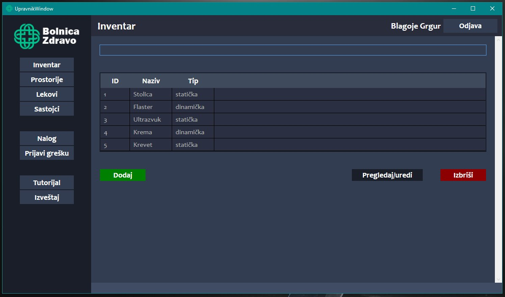
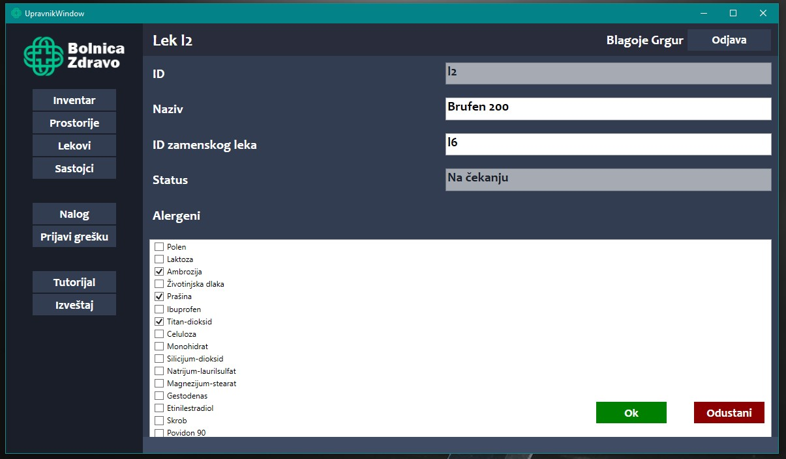

# Informacioni Sistem Bolnice 

Projekat iz predmeta Specifikacija i modeliranje softvera i Interakcija čovek računar, na Fakultetu tehničkih nauka.

## O Projektu

Aplikacija Informacioni sistem Bolnice "Zdravo" rađena je kao WPF aplikacija (koristeći C# i XAML). Baratanje podacima izvršeno je preko JSON fajlova, sačuvanih u folderu **Data**. Svaki student bio je primarno zadužen za dizajn i funkcionalnosti jedne od 4 aplikacije za različite korisnike, poštujući specifikacije za iste. Ovde je prisutna varijacija uređaja na kojima se koristi aplikacija, kao i profila korisnika za koje je prvenstveno namenjena. 

Projekat je rađen implementirajući **SOLID** principe, **dizajn paterne**, kao i **MVVM** arhitekturu. 

Radi testiranja aplikacije, korisnik u folderu *Data* može pročitati neke od login podataka za svake od korisnika.

## Implementacija

U folderu *UseCase Diagram* nalazi se PowerDesigner fajlovi pomoću kojih se može otvoriti dijagram slučajeva korišćenja, iz perspektive četiri zasebna korisnika aplikacije: pacijent, lekar, sekretar i upravnik. 

U folderu *Class Diagram* nalazi se glavni klasni dijagram, kao i dijagrami sekvence i dijagrami aktivnosti.

## Korišćeni alati

► PowerDesigner 16,5

► Balsamiq Wireframes

► Microsoft Visual Studio

### Autori

► **Miloš Živić**, RA75/2018

► **Nikola Jovišič**, RA74/2018

► **Đorđe Krsmanović**, RA71/2018

► **Tara Pogančev**, RA80/2018

## Screenshots

